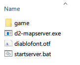
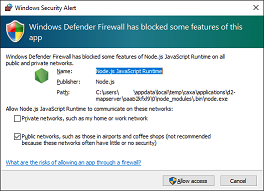

# Running your own map server

There are two ways to run the map server, the easy way (this page) or using docker, see [DOCKERSERVER.md](./DOCKERSERVER.md)

**NOTE**: You don't need to run this on a dedicated server, it's just software you can run on your own PC.

## Installation

You can find the latest version here:
https://github.com/joffreybesos/d2-mapserver/releases/latest

- Download the `d2-mapserver-vxxx.zip` file from the above link.
- Extract the zip file to it's own folder.
- Download the D2 LoD game files - [zip download link](https://mega.nz/file/AhNDgIYY#fGM0RqANpqICodEARRToXbAXt1Yp3JVz5Dk1M8XlZNI).
- Extract the zip file in your `d2-mapserver` folder, it should create a new folder called `game`
    Your files should look like this:  
      
- Double click the `d2-mapserver.exe` executable  

If you get this prompt, just click 'Allow access'
  

You should see a window popup with the text `Running on http://localhost:3002`  
If you see this then the map server is running.  
Minimize this window, if you close it the map server will stop.  

You should then be able to access this URL in your browser <http://localhost:3002/v1/map/12345/2/117/image>  

### Configure the Map Hack

Download the latest version here:
<https://github.com/joffreybesos/d2r-mapview/releases/latest>

- Download the `d2r-v2.x.x.exe` and `settings.ini` files
- Edit the `settings.ini` file change the baseUrl setting to `baseUrl=http://localhost:3002`  

Now you can start D2R and then run the `d2rmap-v2.x.x.exe` after you start the game.

### Troubleshooting

If the window quickly pops up and disappears straight away, try running `d2-mapserver.exe` from the cmd prompt.
That will give you a more detailed error message.

If you are having startup issues, delete this temp folder: `C:\Users\<username>\AppData\Local\Temp\caxa`

#### Error messages
1. `"Did not find the Diablo 2 LoD files in the expected location"`
    This means you may have extracted the D2 LOD files incorrectly. In the zip file, the folder is called `Diablo II 1.13c` but it should be `game`
3. `"Error: listen EADDRINUSE: address already in use :::3002"`
    This means you have another instance of the map server running, or some other process using that port on your PC.
    Either kills the other instance of the map server, or use a different port with `set PORT=3003`
2. `"Did not find static files in build folder"` or
3. `"Did not find ./bin/d2-map.exe files"`
    This means somehow those files are missing, restore them from the original zip file
4. `"Server error generating map"`
    If you get this in the browser when testing the server, look at the map server window for more information.
    It's likely a problem with your D2 game files.
    
